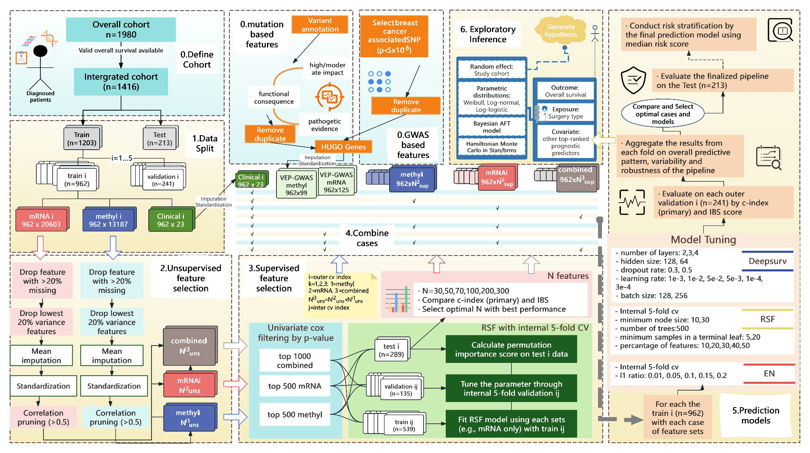

ENAR DataFest 2026 WinnerCompetition project

## Overview

Our GWU team evaluated whether integrating high-dimensional molecular information could improve breast-cancer survival prediction beyond traditional clinical variables. The project won first place at ENAR DataFest 2026.

## Analytical problem

Multi-omics data can add biological detail while also increasing dimensionality, instability, and the opportunity for overfitting. The central question was not simply whether a more complex model could fit the available data, but whether its predictive value held across validation settings.

## Why it matters

Responsible biomarker modeling requires evidence that additional complexity improves prediction in a repeatable way. Comparing clinical-only, single-omics, and integrated approaches helps separate occasional gains from dependable improvements.

## My contribution

I served as the GWU team leader, coordinating analytical decisions, model comparison, interpretation, and the final team presentation. I also created the analytical workflow used to organize and communicate the team's end-to-end approach.

## Data and study design

The competition used breast-cancer data from The Cancer Genome Atlas, accessed through cBioPortal. Inputs included clinical variables, mRNA expression, DNA methylation, and somatic mutation information. We compared clinical-only models with single-omics, multi-omics, and prior-knowledge-informed feature representations.

## Statistical methods

The analysis used a nested validation framework to compare feature sets and model families while keeping final testing separate from model development. I created the analytical workflow below to organize and communicate the team's end-to-end approach.

<figure class="workflow-figure">

<figcaption>End-to-end analytical workflow created by Kexin Fu for the GWU ENAR DataFest 2026 project. Select the figure to view it at full resolution.</figcaption>
</figure>

View an accessible workflow summary

<ol class="workflow-map" aria-label="Multi-omics survival prediction workflow">
<li><strong>Define cohorts</strong>Overall survival cohort and complete multi-omics subset</li>
<li><strong>Create nested splits</strong>Held-out test set with repeated outer training and validation folds</li>
<li><strong>Prepare omics features</strong>Missingness filtering, imputation, standardization, variance filtering, and correlation pruning</li>
<li><strong>Select features</strong>Data-driven Cox screening plus mutation- and GWAS-informed alternatives</li>
<li><strong>Assemble comparisons</strong>Clinical-only, single-omics, combined multi-omics, and prior-informed feature sets</li>
<li><strong>Fit and tune models</strong>Elastic-net Cox, random survival forest, and DeepSurv</li>
<li><strong>Evaluate prediction</strong>Outer-fold C-index and integrated Brier score, followed by held-out testing and risk stratification</li>
<li><strong>Interpret signals</strong>Feature importance and exploratory Bayesian survival analysis</li>
</ol>

## Results and practical contribution

Clinical-only models generally performed as well as or better than models that added omics data. Among the omics configurations, mRNA tended to add more predictive value than methylation, while prior-informed feature construction did not consistently outperform data-driven selection. No model family dominated every metric. The practical lesson was that biological detail and model complexity do not automatically yield more stable out-of-sample prediction.

## Limitations

This was a time-bounded competition analysis rather than a peer-reviewed clinical prediction model. Sample size limited power to distinguish modest performance differences; fold-to-fold variability showed uncertainty; overall survival is a broad endpoint; and feature selection may be unstable in high-dimensional data. Independent external validation would be required before clinical use.

## Outputs

<a class="output-link-card" href="https://publichealth.gwu.edu/departments/biostatistics-and-bioinformatics/student-spotlight">
<strong>Official project feature</strong>
GWSPH Student Spotlight · ENAR DataFest 2026 first place
</a>

## Reproducibility and availability

Data and code available after organization and approval.
